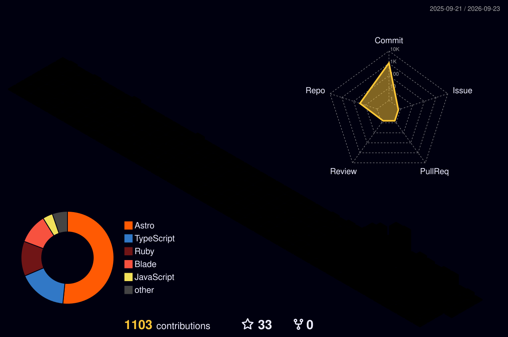

<!-- Generated by GitHub Profile Agent Console + Luminaria customization -->
<p align="center">
  <picture>
    <source media="(max-width: 760px) and (prefers-color-scheme: dark)" srcset="./assets/hero/agent-console-e199a9b3-mobile-dark.svg">
    <source media="(max-width: 760px)" srcset="./assets/hero/agent-console-e199a9b3-mobile-light.svg">
    <source media="(prefers-color-scheme: dark)" srcset="./assets/hero/agent-console-e199a9b3-dark.svg">
    <source media="(prefers-color-scheme: light)" srcset="./assets/hero/agent-console-e199a9b3-light.svg">
    
  </picture>
</p>

<p align="center">
  
</p>

<p align="center">
  
  
  
</p>

---

## 🎵 Now Playing

<p align="center">
  
</p>
<p align="center">
  
</p>
<p align="center">
  <a href="https://open.spotify.com/track/2GBgiuXwY1KzJMA0gSAr9J">
    
  </a>
</p>

---

## 💡 About Me

Aspiring software developer who enjoys building practical, clean, and meaningful applications.

Learning and exploring web apps, mobile apps, backend systems, databases, automation, and SaaS-style products.

> 🕯️ **Why `luminaria`?**  
> Inspired by the Latin word *luminaria*, meaning "lights" or "sources of inspiration".  
> It also resembles **Nuari** phonetically: `luminari ≈ nuari`.  
> I want to build software that brings clarity, solves real problems, and creates value.

---

## 🚀 Current Focus

| Area | What I am exploring |
| --- | --- |
| **Fullstack Web Development** | React, Next.js, Astro, Vue, Node.js — building end-to-end web applications. |
| **Mobile Development** | Flutter, Dart, Kotlin — exploring cross-platform and native mobile apps. |
| **Backend & Databases** | Express, Laravel, Rails, Go, PostgreSQL, Supabase — designing robust APIs and data layers. |
| **Automation & AI** | n8n workflows, AI-assisted coding, and developer tooling to ship faster. |

---

## 🛠️ Tech Stack

<p align="center">
  
</p>

---

## 🔥 Featured Projects

| Project | Focus | Why it matters |
| --- | --- | --- |
| [**TopZone**](https://github.com/luminariadev) | Cafe POS System | A modern Cafe POS PWA with Astro + Supabase + Vercel, featuring inventory management and reporting. |
| [**Laundry System**](https://github.com/luminariadev) | Business Management | Complete laundry business management system with order tracking and customer management. |
| [**Booking System**](https://github.com/luminariadev) | Web & Mobile | Cross-platform booking system for scheduling and reservations. |
| [**My Portfolio**](https://github.com/luminariadev) | Portfolio Website | Personal portfolio built with Next.js 16 + React 19, dark theme with GSAP animations. |

---

## 📊 Analytics & Activity

<p align="center">
  
  
</p>

<p align="center">
  
</p>

---

## 🌌 3D Contributions

<p align="center">
  
</p>

---

## 📌 Development Philosophy

```txt
Think clearly.
Build gradually.
Understand deeply.
Commit consistently.
Improve continuously.
```

---

## 📫 Let's Connect

<p align="center">
  <a href="mailto:rizkianuari83@gmail.com">
    
  </a>
  <a href="https://linkedin.com/in/rizkia-nuari-fujiana">
    
  </a>
  <a href="https://github.com/luminariadev">
    
  </a>
</p>

---

<p align="center">
  
</p>
