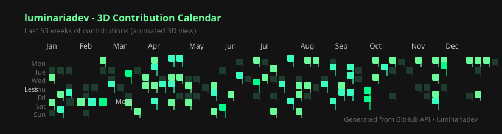

<pre>
✦  ⋆  .  ✦  ·  ✦  ·  ✦  ⋆  ✦
⋆  ·  ✦  ·  ☾  L U M I N A R I A  ☽  ·  ✦  ·  ⋆
✦  ⋆  .  ✦  ·  ✦  ·  ✦  ⋆  ✦

██╗     ██╗   ██╗███╗   ███╗██╗███╗   ██╗ █████╗ ██████╗ ██╗ █████╗
██║     ██║   ██║████╗ ████║██║████╗  ██║██╔══██╗██╔══██╗██║██╔══██╗
██║     ██║   ██║██╔████╔██║██║██╔██╗ ██║███████║██████╔╝██║███████║
██║     ██║   ██║██║╚██╔╝██║██║██║╚██╗██║██╔══██║██╔══██╗██║██╔══██║
███████╗╚██████╔╝██║ ╚═╝ ██║██║██║ ╚████║██║  ██║██║  ██║██║██║  ██║
╚══════╝ ╚═════╝ ╚═╝     ╚═╝╚═╝╚═╝  ╚═══╝╚═╝  ╚═╝╚═╝  ╚═╝╚═╝╚═╝  ╚═╝
</pre>

<p align="center">
  
</p>

<p align="center">
  
  
  
</p>

---

## 🎵 Now Playing

<p align="center">
  
</p>
<p align="center">
  
</p>
<p align="center">
  <a href="https://open.spotify.com/track/2GBgiuXwY1KzJMA0gSAr9J">
    
  </a>
</p>

---

## 💡 About Me

I'm **Rizkia Nuari Fujiana**, also known as **`luminariadev`** — an aspiring software developer who enjoys building practical, clean, and meaningful applications.

I am currently learning and exploring different areas of software development, including **web apps, mobile apps, backend systems, databases, automation, and SaaS-style products**.

> 🕯️ **Why `luminaria`?**  
> Inspired by the Latin word *luminaria*, meaning "lights" or "sources of inspiration".  
> It also resembles **Nuari** phonetically: `luminari ≈ nuari`.  
> I want to build software that brings clarity, solves real problems, and creates value.

---

## 🚀 Current Focus

- 🧩 Building real-world software projects
- 🌐 Learning full-stack web development
- 📱 Exploring mobile app development
- 🧠 Understanding software architecture and clean code
- 🛠️ Improving Git, GitHub, and project workflow
- ⚙️ Learning how to use AI tools without losing fundamental understanding

---

## 🧭 Learning Tracks

<table>
  <tr>
    <td><b>🌐 Web Development</b></td>
    <td>HTML, CSS, JavaScript, TypeScript, React, Next.js, Vue, Astro</td>
  </tr>
  <tr>
    <td><b>⚙️ Backend Development</b></td>
    <td>Node.js, Express, Laravel, Ruby on Rails, Go, Gin</td>
  </tr>
  <tr>
    <td><b>📱 Mobile Development</b></td>
    <td>Flutter, Dart, Kotlin, Android Development</td>
  </tr>
  <tr>
    <td><b>🗄️ Database</b></td>
    <td>MySQL, PostgreSQL, SQLite, MongoDB, Firebase, Supabase</td>
  </tr>
  <tr>
    <td><b>🧰 Tools & Workflow</b></td>
    <td>Git, GitHub, Docker, VS Code, Postman, Linux</td>
  </tr>
  <tr>
    <td><b>🤖 Automation & AI</b></td>
    <td>n8n, AI-assisted coding, workflow automation</td>
  </tr>
</table>

---

## 🛠️ Tech Stack

<p align="center">
  
</p>

---

## 🔥 Featured Projects

<p align="center">
  <a href="https://github.com/luminariadev">
    
  </a>
  <a href="https://github.com/luminariadev">
    
  </a>
  <a href="https://github.com/luminariadev">
    
  </a>
  <a href="https://github.com/luminariadev">
    
  </a>
</p>

---

## 📊 GitHub Stats

<p align="center">
  
  
</p>

<p align="center">
  
</p>

---

## 🌌 3D Contributions

<p align="center">
  
</p>

---

## 🏆 GitHub Trophies

<p align="center">
  
</p>

---

## 📌 Development Philosophy

```txt
Think clearly.
Build gradually.
Understand deeply.
Commit consistently.
Improve continuously.
```

---

## 📫 Let's Connect

<p align="center">
  <a href="mailto:rizkianuari83@gmail.com">
    
  </a>
  <a href="https://linkedin.com/in/rizkia-nuari-fujiana">
    
  </a>
  <a href="https://github.com/luminariadev">
    
  </a>
</p>

---

<p align="center">
  
</p>
